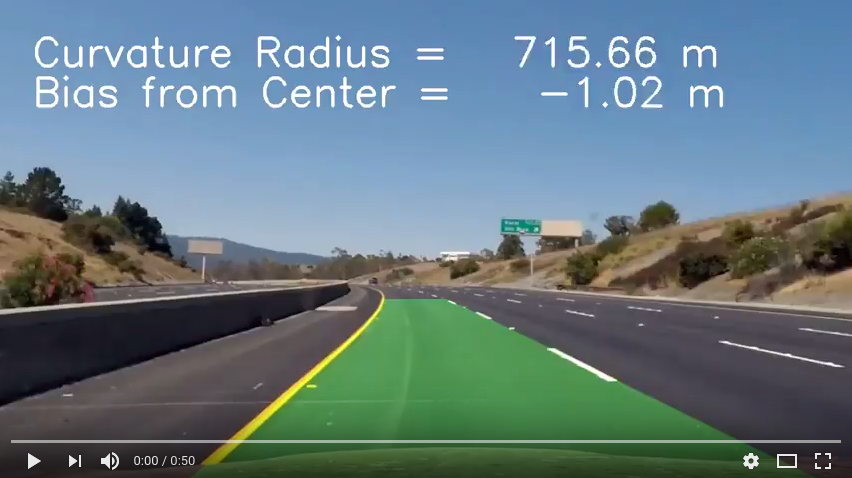

## Advanced Lane Finding (Self-Driving Car Engineer Nanodegree)

This repository contains the code in a form of a pure python module and Jupyter notebook 
that could be used to detect lane lines on the road. Advanced computer vision techniques are used. There is [`Writeup.md`](./Writeup.md) that summarizes the work done.

Below video is the result of lane lines detection pipeline.

#### Development Environment
Use `udacity/carnd-term1-starter-kit:latest` docker image to run the code in this repository.
